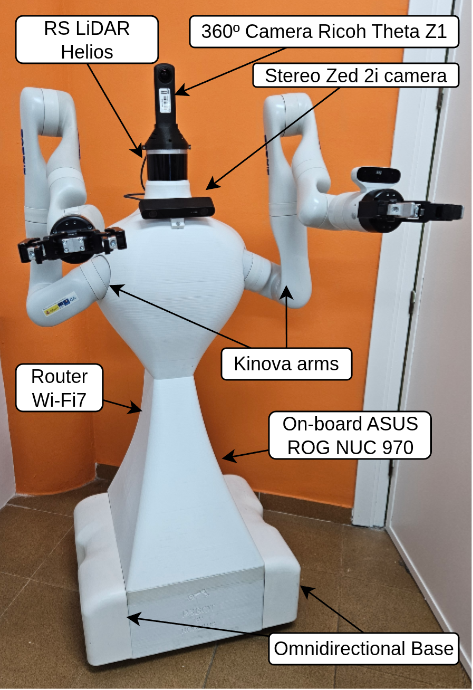
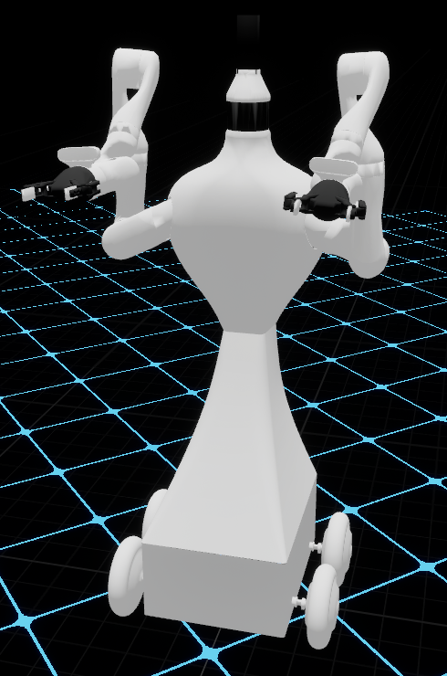
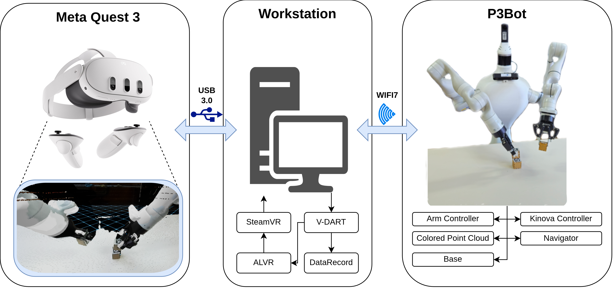
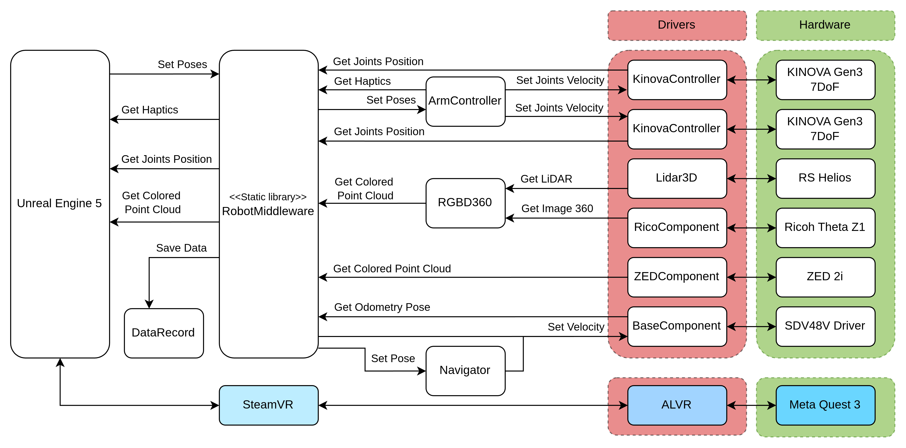

# V-DART — VR-based Dual-Arm Robot Teleoperation

<!--  -->

-orange?logo=linux&logoColor=white)


**V-DART** (VR-based Dual-Arm Robot Teleoperation) is an immersive Virtual Reality
framework, built on **Unreal Engine 5.6.1**, for teleoperating **mobile dual-arm** robotic
systems. An operator wearing a VR headset controls both robot arms through motion-tracked
controllers while navigating the robot's **mobile base** — either with the joysticks or by
physically walking — and every session can be recorded as **machine-learning-ready expert
demonstrations**. V-DART maintains a low-latency, bidirectional link between the VR
interface and the target, which may be a **physical robot** or a **simulator**.

> V-DART extends our earlier stationary dual-arm framework (Torrejón et al., *Electronics*,
> 2026) with mobile base control and a data-recording layer. See
> [Papers & Citation](#papers--citation).

<p align="center">
  
  &nbsp;&nbsp;
  
</p>

---

## Features

- **Dual-arm teleoperation** — each VR controller maps to one Kinova Gen3 7-DoF arm's
  tool-point, with a per-hand deadman safety button and trigger-driven gripper control.
- **Mobile base control** — omnidirectional base driven by joysticks *or* by direct
  mapping of the operator's physical position/orientation (**follow mode**), plus
  navigation-assisted goal poses.
- **Two viewpoint modes** — world-centric (comfort) and robot-centric (embodiment),
  toggled at runtime.
- **Real-time point-cloud reconstruction** — GPU-accelerated (Niagara) rendering of
  coloured LiDAR and ZED 2i RGB-D point clouds.
- **Bidirectional VR ↔ hardware / simulation** — low-latency control loop with haptic
  feedback; targets a real robot or a Webots simulation through the same application.
- **Expert demonstration recording** — synchronised binary logging of user pose,
  controller inputs and robot state for behavior cloning and imitation learning.
- **Multi-robot support** — ships a mobile P3Bot and a stationary Kinova configuration;
  new robots need only a mesh, an animation blueprint and a middleware endpoint.

📖 **Full details:** [docs/FEATURES.md](docs/FEATURES.md)

---

## Architecture

V-DART runs as an Unreal Engine application on a workstation independent from the robot. It
receives sensor/state streams from the robot, reconstructs the world in Unreal, augments it
with a virtual robot mesh, streams a stereoscopic view to the headset, and sends the
operator's motion/inputs back as control commands. **All robot communication is funneled
through a single shared library (`RobotMiddleware.so`)**, which today speaks RoboComp/ZeroC
ICE but is designed to be re-targetable to ROS/ROS 2 without touching the Unreal app.

```
  Meta Quest 3  ──ALVR/SteamVR(OpenXR)──►  Unreal Engine 5.6.1 (workstation)
       ▲                                          │
       │ stereoscopic render                      │  RobotMiddleware.so
       │                                          ▼   (RoboComp / ZeroC ICE)
       └──────────────────────────────────►  P3Bot  (Wi-Fi 7)
              sensor + state streams  ◄──►  control commands
```





> *Unreal Engine interacts with the robotics back-end only through `RobotMiddleware`, which
> bridges the XR application with the RoboComp/ICE modules and their device drivers.*

**Real components:**

| Layer | Component | Location |
| --- | --- | --- |
| VR / operator | `AExpert` (Pawn) | `Source/VRTeleoperation/…/Expert.*` |
| Robot actor | `AP3Bot`, `AKinova` (Actors) | `Source/VRTeleoperation/…/P3Bot.*`, `Kinova.*` |
| Animation | `UP3botAnimInstance` | `…/P3botAnimInstance.*` |
| Point cloud | `UPointCloudComponent` (Niagara) | `…/PointCloudComponent.*` |
| Middleware | `RobotMiddleware.so` | `CustomLibs/src/RobotMiddleware.*` |
| Data recording | `DataRecord` | `CustomLibs/utils/DataRecord.*` |
| ICE/Slice interfaces | `*.ice` | `CustomLibs/ices/` |

📐 **Full architecture (entity-component model, middleware, data format, latency,
multi-robot):** [docs/ARCHITECTURE.md](docs/ARCHITECTURE.md)


## Tested Environment

This framework has been developed and validated under the following configuration:

- **Operating System:** Ubuntu 24.04 LTS
- **Game Engine:** Unreal Engine 5.6.1 (compiled with Clang 18.1.3, `std:c++latest`)
- **Robotics Simulator:** Webots
- **Communication:** ZeroC ICE / RoboComp
- **VR headset:** Meta Quest 3 via ALVR (2240 × 2144 px per eye @ 90 Hz)
- **Robot deployment:** [p3botUR](https://github.com/alfiTH/robocomp-p3bot/blob/main/tools/p3botUR.sh) configuration script (automated setup of the robotic environment)

---

## Installation

### 1. VR & OpenXR setup
The system relies on ALVR and OpenXR for headset communication.
- Install [ALVR](https://github.com/alvr-org/ALVR)
- Install [Steam](https://store.steampowered.com/about/) (official `.deb` package only; avoid Flatpak).
- OpenXR drivers:
```bash
sudo apt install libopenxr-dev libopenxr-loader1 openxr-layer-corevalidation
```

### 2. Graphics (Vulkan)
Ensure your drivers are up to date:
```bash
sudo apt install vulkan-tools libvulkan1 libvulkan-dev vulkan-validationlayers nvidia-vulkan-common vulkan-utils
```
Test Vulkan:
```bash
sudo apt install vkcube
vkcube
```

### 3. Unreal Engine 5.6.1
1. Download the Linux binaries ([Linux_Unreal_Engine_5.6.1.zip](https://www.unrealengine.com/en-US/linux)).
2. Extract to your preferred software directory (e.g. `$HOME/software/`).
3. Verify the editor runs:
```bash
cd Linux_Unreal_Engine_5.6.1/Engine/Binaries/Linux
./UnrealEditor
```

---

## Building

### Communication library (ICE / RoboComp)
The system uses a custom middleware to interface with RoboComp components via ZeroC ICE.

1. Generate C++ classes from the Slice files:
```bash
cd CustomLibs/include
slice2cpp ../ices/KinovaArm.ice ../ices/Lidar3D.ice ../ices/VRController.ice ../ices/GenericBase.ice ../ices/OmniRobot.ice
```
2. Build the shared library:
```bash
cd .. && cmake -B build && make -C build -j12
```
3. Link it into the Unreal binaries:
```bash
cd ..
ln -s $(pwd)/CustomLibs/build/libRobotMiddleware.so Binaries/Linux/libRobotMiddleware.so
```

### Compiling the Unreal project
```bash
~/software/Linux_Unreal_Engine_5.6.1/Engine/Build/BatchFiles/Linux/Build.sh \
    VRTeleoperationEditor Linux Development \
    ~/Code/VR_teleoperation/VRTeleoperation.uproject
```

---

## Quickstart / Usage

1. **Headset:** connect your VR headset via ALVR / SteamVR.
2. **Launch the editor:**
```bash
./UnrealEditor ~/Code/VR_teleoperation/VRTeleoperation.uproject
```
3. **Open a map:** `P3Bot_demo` (mobile dual-arm, default) or `Kinova_demo` (stationary).
4. **Teleoperate:**
   - Hold each controller's **deadman** button and move it to drive the matching arm; the
     **trigger** opens/closes that arm's gripper.
   - **Left joystick** = base translation, **right joystick** = base rotation; press the
     right joystick to toggle **follow mode**; double-press the left joystick to switch
     viewpoint mode.
   - Full mapping: [docs/FEATURES.md](docs/FEATURES.md) and
     `docs/images/vr-controller-mapping.png`.
5. **Record demonstrations:** recording is controlled through `RobotMiddleware`
   (`startRecording` / `stopRecording` / `saveRecording`).

### Technical notes
- **Game Mode:** logic in `Content/Blueprints/VRGameMode`.
- **Input handling:** Enhanced Input mappings under `Content/Inputs/`.
- **Robot actor:** the robot pawn/actor is wrapped in a Blueprint (`BP_P3Bot` / `BP_Kinova`)
  to leverage Unreal's Enhanced Input system.
- **Asset pipeline (URDF → FBX):** Blender 3.1.2 with `urdf_importer` (`urdf_parser_py` and
  `yamlpy` must be in Blender's Python environment). On import: *Force All Mesh as Type →
  Set type to Skeletal Mesh*.

---

## Papers & Citation

If you use V-DART, please cite the relevant paper(s).

<!-- ### Current work — V-DART (primary)
> Torrejón, A., Calderón, J., Núñez, P., Bustos, P. *V-DART: VR-based Dual-Arm Robot
> Teleoperation with Mobile Base Control and Data Recording.* RoboLab, University of
> Extremadura.

```bibtex
% [PENDIENTE - completar cuando se publique]
@Article{vdart2026,
  AUTHOR  = {Torrejón, Alejandro and Calderón, Jorge and Núñez, Pedro and Bustos, Pablo},
  TITLE   = {V-DART: VR-based Dual-Arm Robot Teleoperation with Mobile Base Control and Data Recording},
  JOURNAL = {TBD},
  YEAR    = {2026}
  % VOLUME / NUMBER / ARTICLE-NUMBER / DOI / URL -- pending publication
}
``` -->

### Foundational work (published)
> Torrejón, A., Eslava, S., Calderón, J., Núñez, P., Bustos, P. (2026). *Teleoperation of
> Dual-Arm Manipulators via VR Interfaces: A Framework Integrating Simulation and Real-World
> Control.* Electronics, 15(3), 572. https://doi.org/10.3390/electronics15030572

```bibtex
@Article{electronics15030572,
  AUTHOR = {Torrejón, Alejandro and Eslava, Sergio and Calderón, Jorge and Núñez, Pedro and Bustos, Pablo},
  TITLE = {Teleoperation of Dual-Arm Manipulators via VR Interfaces: A Framework Integrating Simulation and Real-World Control},
  JOURNAL = {Electronics},
  VOLUME = {15},
  YEAR = {2026},
  NUMBER = {3},
  ARTICLE-NUMBER = {572},
  URL = {https://www.mdpi.com/2079-9292/15/3/572},
  ISSN = {2079-9292},
  DOI = {10.3390/electronics15030572}
}
```

---

## Contact

RoboLab — Robotics and Artificial Vision, University of Extremadura, Cáceres, Spain.
- Alejandro Torrejón — atorrejon@unex.es