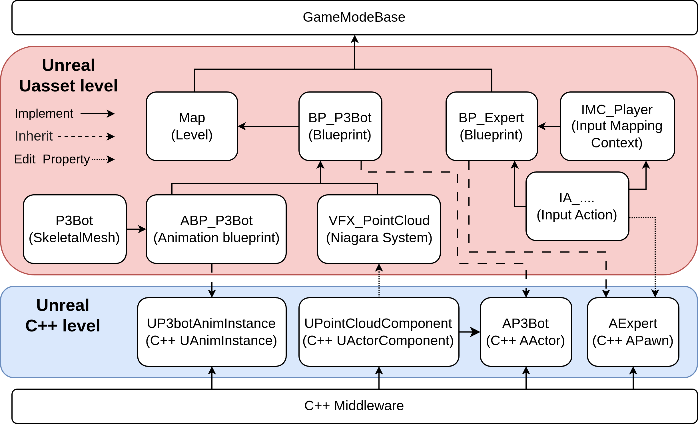
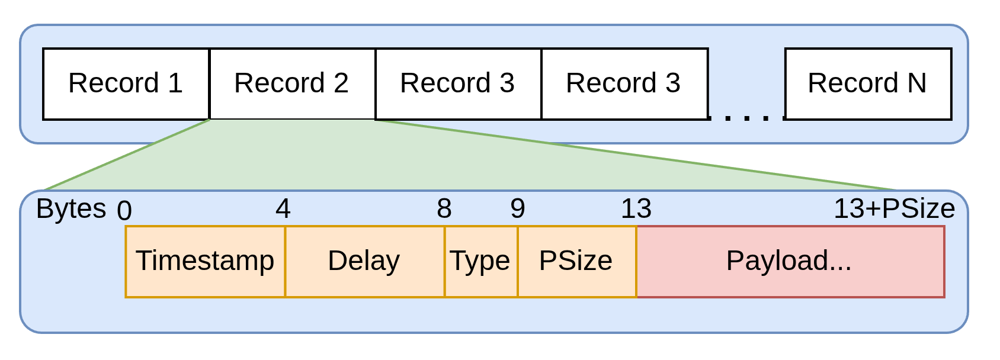
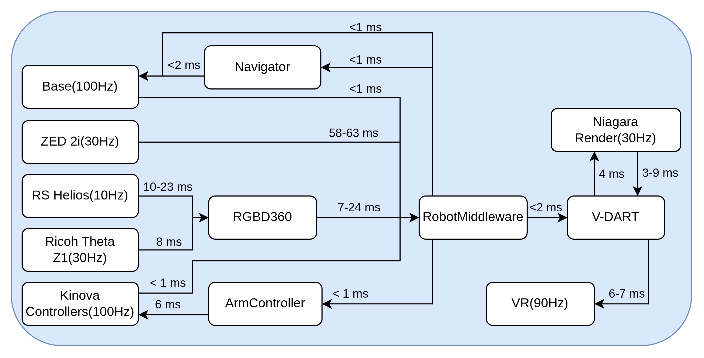

# V-DART Architecture

This document describes the internal architecture of **V-DART** (VR-based Dual-Arm
Robot Teleoperation), how its components communicate, and how the immersive layer is
decoupled from the underlying robotics stack. The content here is derived from the
project's source code and the V-DART paper; see the [main README](../README.md) for a
higher-level overview.

---

## 1. High-level picture

V-DART runs as an Unreal Engine 5.6.1 application on a workstation that is physically
independent from the robot's on-board computer. It:

1. Receives sensor and state streams from the robot (point clouds, arm state, base pose).
2. Reconstructs the perceived world inside Unreal Engine and augments it with a virtual
   mesh of the robot.
3. Streams the resulting stereoscopic view to a VR head-mounted display.
4. Turns the operator's head/controller motion and inputs into control commands that are
   sent back to the robot.
5. Optionally records every input/output as timestamped demonstration data.

All robot communication is funneled through a single shared library
(`RobotMiddleware.so`), so the Unreal application never talks to the robotics middleware
directly.

### Communication topology (headset ↔ workstation ↔ robot)

> *Communication topology between the Meta Quest 3 headset, the V-DART workstation, and
> the P3Bot robot.* The headset connects to the workstation through ALVR (exposed to
> Unreal via SteamVR/OpenXR); the workstation exchanges data with the robot over Wi-Fi 7.

### Component / communication overview

The diagram below shows how Unreal Engine interacts with the robotics back-end **only**
through `RobotMiddleware`, which bridges the XR application with the RoboComp/ICE modules
and their device drivers.

> *Communication and component overview of the proposed system.* Driver components interface
> the physical devices: two Kinova Gen3 arms, RS Helios LiDAR, Ricoh Theta camera, ZED 2i
> stereo camera, and the robot base. The Meta Quest 3 headset is connected through ALVR and
> exposed to Unreal via SteamVR.

**Streams from the robot to the workstation** (confirmed in `RobotMiddleware.h`):

| Stream | Source | Access method |
| --- | --- | --- |
| Coloured point cloud (LiDAR + 360° camera, and/or ZED 2i RGB-D) | On-board sensors | `lockColorCloudData()` |
| Arm state (joint angles / gripper) for both arms | Kinova Gen3 arms | `getRobotState()` |
| Robot global pose (odometry) | Mobile base | `getRobotPose()` |
| Haptic feedback | Robot side | `receiveHaptics()` |

**Commands from the workstation to the robot** (confirmed in `RobotMiddleware.h`):

| Command | Method |
| --- | --- |
| VR head + controller poses and controller inputs | `sendData()` |
| Base velocity command (direct teleoperation) | `setSpeedBase(x, y, yaw)` |
| Base target pose (navigation-assisted) | `setBasePose(target)` |
| Stop base / reset odometry | `stopBase()`, `resetOdometer()` |

---

## 2. Unreal Engine layer — Entity/Component model

> *Schema of entities and components composing the V-DART architecture.*

V-DART follows the Entity-Component paradigm native to Unreal Engine. The real, verified
C++ classes in `Source/VRTeleoperation/` are:

| Element | Type (code) | Role |
| --- | --- | --- |
| `AExpert` | `APawn` (`Expert.h`) | The operator inside the virtual world. Hosts input handling and tracks the operator's head/controller pose. |
| `AP3Bot` | `AActor` (`P3Bot.h`) | Encapsulates the robot representation (skeletal mesh + animation + point cloud) as a single actor. |
| `AKinova` | `AActor` (`Kinova.h`) | Robot actor for the stationary single/dual Kinova configuration (multi-robot support). |
| `UP3botAnimInstance` | `UAnimInstance` (`P3botAnimInstance.h`) | Binds incoming arm joint angles to the joints of the skeletal mesh so the virtual robot mirrors the physical one. |
| `UPointCloudComponent` | `UActorComponent` (`PointCloudComponent.h`) | GPU-accelerated point-cloud rendering via **Niagara**; particles are instantiated once and updated with vectorised operations. |
| `VRGameMode` | Blueprint (`Content/Blueprints/VRGameMode`) | Orchestrates world initialisation and instantiates the expert pawn and robot actor. |

Supporting Unreal assets (in `Content/`):

- **Blueprints:** `BP_Expert`, `BP_P3Bot`, `BP_Kinova`, `ABP_P3Bot`/`ABP_Kinova`
  (animation blueprints), `VRGameMode`.
- **Maps:** `P3Bot_demo.umap` (default), `Kinova_demo.umap`.
- **Inputs:** Enhanced Input mapping contexts under `Content/Inputs/`.

**Enabled UE plugins / modules** (from `VRTeleoperation.uproject` and `VRTeleoperation.Build.cs`):
`OpenXR`, `OpenXREyeTracker`, `OpenXRHandTracking`; module dependencies `EnhancedInput`,
`Niagara`.

---

## 3. Communication middleware (`RobotMiddleware.so`)

The network and control logic is encapsulated in a shared library, **`RobotMiddleware.so`**
(`CustomLibs/src/RobotMiddleware.{h,cpp}`), exposing a stable C++ interface to Unreal
Engine. Key properties:

- **Singleton** interface (`RobotMiddleware::getInstance()`), non-copyable / non-movable.
- Hides all ICE / RoboComp details behind a `pImpl` pointer — Unreal never sees the
  middleware types.
- The current implementation uses **RoboComp** (component framework on top of **ZeroC ICE**),
  but the abstraction is middleware-agnostic and can be re-targeted to ROS / ROS 2 without
  touching the Unreal application.

The ICE/Slice interfaces the middleware binds to live in `CustomLibs/ices/`:
`GenericBase.ice`, `OmniRobot.ice`, `KinovaArm.ice`, `Lidar3D.ice`, `Navigator.ice`,
`VRController.ice`. C++ stubs are generated with `slice2cpp` into `CustomLibs/include/`.

---

## 4. Data recording layer

See [FEATURES.md → Expert demonstration recording](FEATURES.md#expert-demonstration-recording)
for the user-facing description. The implementation lives in
`CustomLibs/utils/DataRecord.{h,cpp}` and is driven from `RobotMiddleware`
(`startRecording()`, `stopRecording()`, `saveRecording()`, `isRecording()`).

> *Structure of the concatenated record stream (top) and byte-level layout of the 13-byte
> `RecordHeader` (bottom).*

**Format (verified in `DataRecord.h`):** a flat, self-describing sequence of
*Type-Length-Value* records concatenated with no separator, no file header and no index.
Each record is a 13-byte `RecordHeader` followed by a packed payload struct written to disk
via a direct `memcpy` of its in-memory layout (`#pragma pack(1)`, zero-cost encoding).

`RecordHeader` (13 bytes, `#pragma pack(push,1)`):

| Field | Offset | Type | Description |
| --- | --- | --- | --- |
| `timestamp` | 0 | `uint32_t` | Milliseconds since `startRecording()`; single monotonic clock shared by all record types. |
| `delay` | 4 | `uint32_t` | Sample latency (real acquisition delay, or polling-loop duration). |
| `type` | 8 | `uint8_t` (enum) | Discriminator for the payload struct. |
| `payloadSize` | 9 | `uint32_t` | Payload length in bytes. |

`RecordType` values (verified in `DataRecord.h`): `VRPose`, `VRController`, `VRHaptic`,
`ColorCloudData`, `ArmJoints`, `RobotPose`, `BaseSpeedCmd`, `BasePoseCmd`.

Output records (`BaseSpeedCmd`, `BasePoseCmd`, commanded set-points) are written
synchronously with Unreal's tick; input records (`VRPose`, `VRController`, `VRHaptic`,
`ArmJoints`, `RobotPose`) are written from `RobotMiddleware`'s independent polling loops.
Synchronised tuples are reconstructed downstream by **joining records that share the same
`timestamp`** rather than being captured atomically.

> **Format caveat (from the paper):** the format is *not architecture-portable* — byte
> order and ABI are not fixed, so a file is only guaranteed to re-read correctly on the same
> architecture (x86-64, little-endian) and compiler/flags that produced it. It is an internal
> log format, not an interchange format.

---

## 5. Time alignment and latency

- All machines on the local network are time-aligned via **PTP** (Precision Time Protocol),
  reaching sub-millisecond clock offsets.
- `RobotMiddleware` pairs each incoming ZED 2i point-cloud frame with the robot's kinematic
  state at capture time via a timestamped buffer.
- Measured end-to-end latency (ZED 2i capture → render in headset): **≈143 ms**. *[VERIFICAR:
  cifra tomada del paper nuevo, no verificable desde el código.]*
- The robot **mesh** is refreshed almost instantly from joint-encoder / odometry data
  (near-zero latency), decoupled from the slower point-cloud pipeline.
- Base odometry runs at **100 Hz** vs. the camera feed at **30 Hz**, producing a transient
  point-cloud lag during base rotations (imperceptible in robot-centric view).

> *End-to-end latency breakdown of the VR teleoperation system.*

---

## 6. Multi-robot support

V-DART is not tied to a specific embodiment. Adding a new robot requires only:

1. A **SkeletalMesh** describing its kinematic structure.
2. An **Animation Blueprint** binding incoming joint states to the mesh joints.
3. A **middleware endpoint** exposing the robot state and accepting the control commands.

The same Unreal application has been used to teleoperate a stationary Kinova Gen3 setup
(`Kinova_demo.umap`, `AKinova`), differing from P3Bot only in the disabled base-motion
channel and the number of active arms.
