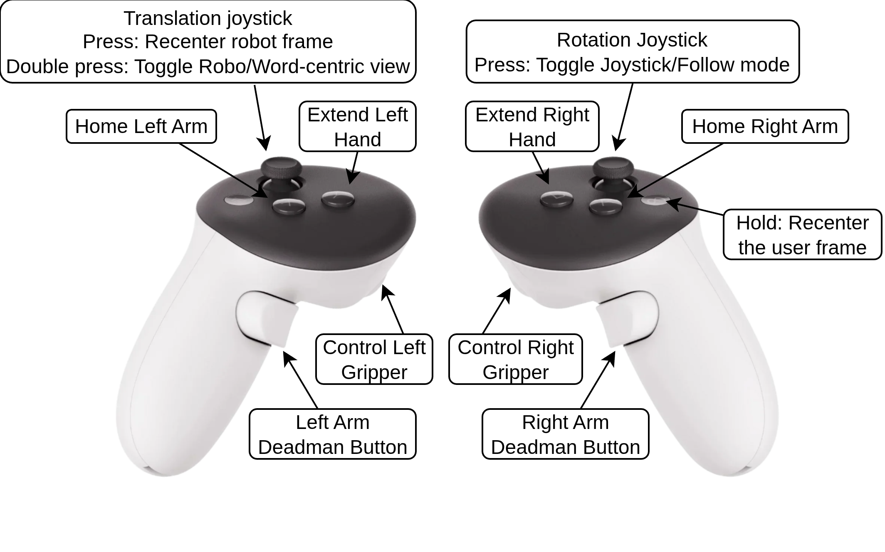

# V-DART Features

Detailed description of the features exposed by **V-DART**. For the architecture behind
them, see [ARCHITECTURE.md](ARCHITECTURE.md); for a summary, see the
[main README](../README.md).

---

## Immersive dual-arm teleoperation

Each VR controller drives one of the robot's two arms. The pose of each controller in the
tracked area is mapped to the tool-point set-point of the corresponding **Kinova Gen3
7-DoF** arm, held active by a per-hand **deadman button** (safety: releasing the button
freezes the arm). Gripper open/close is bound to each controller's trigger (trigger pull
→ closure; `1.0` = fully closed, `0.0` = fully open), so each hand fully drives one arm
end-effector without cross-coupling.

Two auxiliary buttons per controller modulate the mapping:

- **Home** — returns the corresponding arm to a canonical resting pose (quick recovery from
  awkward configurations).
- **Extend** — virtually extends the reach of the operator's hand along the controller's
  pointing direction, so far tool-point targets remain reachable inside a bounded VR play
  area without physically walking to them.

> *V-DART input mapping on the Meta Quest 3 controllers. Each hand drives one arm through
> the corresponding deadman button and trigger, while the joysticks are dedicated to base
> locomotion and view management.*

---

## Mobile base control

The **omnidirectional mobile base** is driven through two complementary modalities:

- **Joystick control** — the left joystick commands planar translation of the base; the
  right joystick commands rotation around the vertical axis. Pressing the translation
  joystick recenters the robot frame (subsequent motions are relative to the operator's
  current orientation).
- **Follow mode** — pressing the rotation joystick toggles a mode in which the base
  autonomously tracks the operator's own physical displacement within the tracked space, so
  the user navigates the robot simply by walking.

The base accepts either **direct velocity commands** (`setSpeedBase`) or
**navigation-assisted goal poses** (`setBasePose`) processed by the on-board navigation
stack.

> **Safety limits (from the paper):** base linear velocity ≤ 0.8 m/s, angular velocity
> ≤ 1.5 rad/s; arm joint velocities ≤ 50°/s.

---

## Viewpoint modes

Toggled at runtime (double press of the translation joystick):

- **World-centric view** — the virtual robot is rendered at its true pose and moves through
  the reconstructed world as the physical robot navigates; the operator can *recenter* the
  view to the robot's frame. Recommended for users prone to motion sickness.
- **Robot-centric view** — the virtual robot stays anchored at the world origin and the
  environment moves around it. Maximises the sense of embodiment, but the optical flow can
  induce cybersickness in less experienced operators during long navigation.

Both modes share the same input mapping, manipulation semantics and data-logging pipeline,
so demonstrations recorded in either mode are directly comparable.

---

## Real-time point-cloud reconstruction

The workstation reconstructs the perceived environment from the robot's coloured point
clouds:

- A **coloured LiDAR point cloud** (RoboSense Helios LiDAR + 360° Ricoh Theta Z1 imagery
  projected onto the returns).
- A **coloured RGB-D point cloud** from the **ZED 2i** stereo camera.

Rendering is handled by `UPointCloudComponent`, a **Niagara**-based GPU component that
instantiates particles once and updates them with vectorised operations, sustaining
interactive frame rates even with multi-million-point clouds (≈900k points at 30 Hz,
displayed at 90 fps). 

---

## Bidirectional VR ↔ hardware / simulation communication

V-DART keeps a low-latency, bidirectional loop between the VR interface and the target,
which can be **either a physical robot or a simulator** (Webots was used in the previous
work). The robot streams sensor and state data up; the workstation streams control commands
down, and **haptic feedback** (`receiveHaptics`) is returned to the controllers. All of this
passes through the middleware abstraction (see
[ARCHITECTURE.md §3](ARCHITECTURE.md#3-communication-middleware-robotmiddlewareso)), so the
same Unreal application targets simulation or real hardware unchanged.

---

## Expert demonstration recording

V-DART includes a data-logging layer (`DataRecord`) that captures **expert demonstrations**
during teleoperation for downstream machine-learning use (e.g. behavior cloning), with no
separate manual annotation.

- Synchronously records **user pose, controller inputs, and robot state** on a single
  monotonic clock.
- Writes a compact binary **Type-Length-Value** stream via direct `memcpy` (zero-cost
  encoding, recordable at control-loop frequency without impacting VR responsiveness).
- Record types: VR pose, VR controller, VR haptic, coloured cloud, arm joints, robot pose,
  commanded base speed, commanded base pose.
- Synchronised tuples are reconstructed downstream by joining records that share the same
  timestamp.

See [ARCHITECTURE.md §4](ARCHITECTURE.md#4-data-recording-layer) for the byte-level format.

---

## Multi-robot / multi-embodiment

The framework is not P3Bot-specific: it also ships a stationary **Kinova** configuration
(`Kinova_demo.umap`). Adding a new robot only requires a skeletal mesh, an animation
blueprint binding joint states, and a middleware endpoint. See
[ARCHITECTURE.md §6](ARCHITECTURE.md#6-multi-robot-support).
